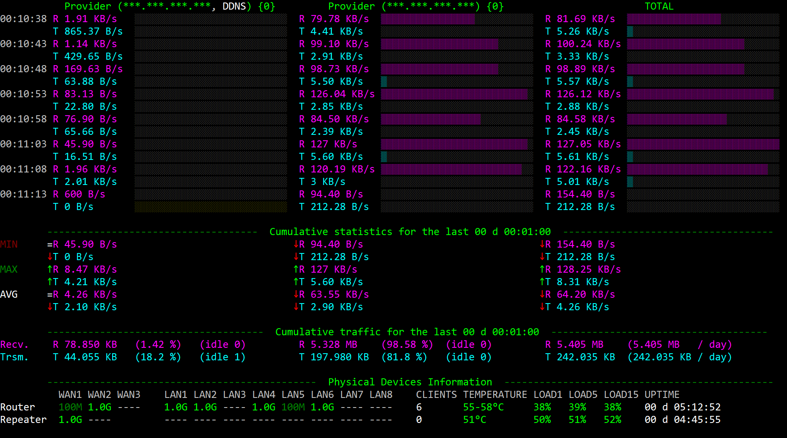

# ASUS_Router_Monitoring
Console utility to monitor ASUS DualWAN routers traffic and speed

**Usage:**
1. Make adjustments to your "ASUS_Router_Monitoring.xml_sample" (login(s). password(s), ip(s)).
2. Run this soft as "php ASUS_Router_Monitoring.php".
3. Enjoy.

**Expected behavior:**

