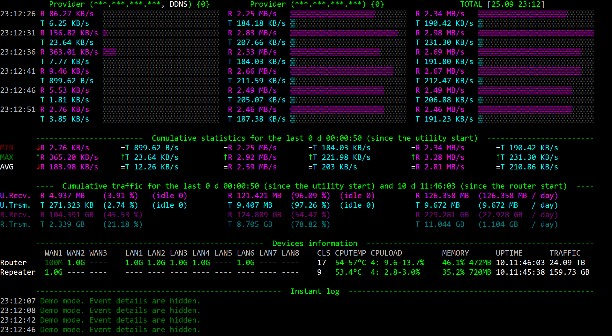

# ASUS Router Monitoring
Console utility to monitor ASUS DualWAN routers traffic and speed.
It also shows WAN and LAN ports statuses and speed, CPU load and temperature.

**Usage:**
1. Clone this repository to your local machine.
2. Make adjustments to your "ASUS_Router_Monitoring.xml_sample" (login(s). password(s), ip(s)).
3. Run this soft as "php ASUS_Router_Monitoring.php".
4. Enjoy.

**Expected behavior:**

